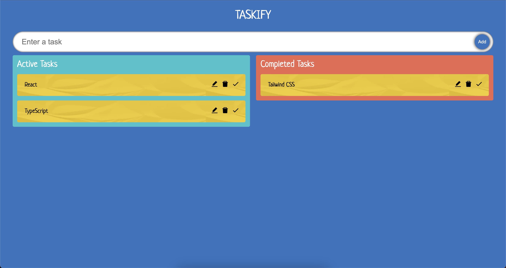

# TaskList Application with React & TypeScript

## :computer: Setup

1. Clone the repository and install its features.

```
npm install or yarn install
```

2. Use the project locally (localhost).

```
npm start or yarn start
```

## Project Features

:heavy_check_mark: You can add tasks to be done from the input field <br />
:heavy_check_mark: User can delete, edit and complete the 'todo' <br />
:heavy_check_mark: Ability to categorize the added item (Drag and Drop) <br />
:heavy_check_mark: Added items or categorized items are sortable <br />

## :fire: Technologies and Libraries

:point_right: React <br />
:point_right: TypeScript <br />
:point_right: React-Icons <br />
:point_right: React-Beautiful-DND <br />

## Screenshot

